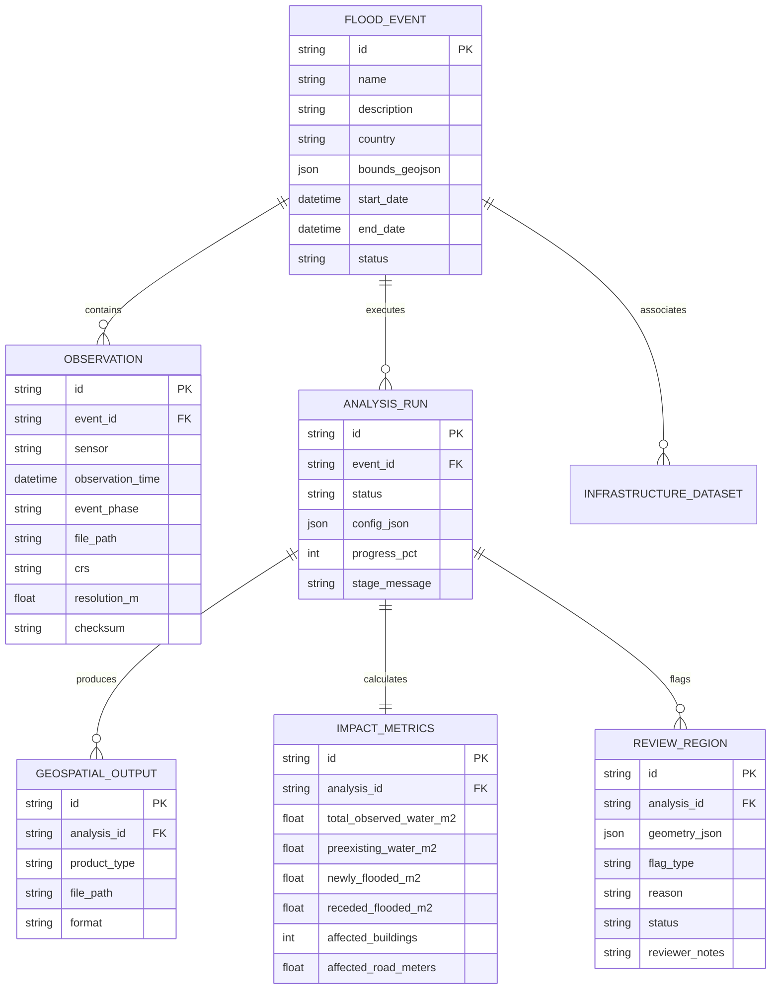

# Relational Data Model

The platform uses SQLAlchemy with support for both lightweight SQLite (for instant local zero-dependency development) and PostgreSQL / PostGIS (via Docker Compose).

```mermaid
erDiagram
    FLOOD_EVENT ||--o{ OBSERVATION : contains
    FLOOD_EVENT ||--o{ ANALYSIS_RUN : executes
    FLOOD_EVENT ||--o{ INFRASTRUCTURE_DATASET : associates
    ANALYSIS_RUN ||--o{ GEOSPATIAL_OUTPUT : produces
    ANALYSIS_RUN ||--|| IMPACT_METRICS : calculates
    ANALYSIS_RUN ||--o{ REVIEW_REGION : flags

    FLOOD_EVENT {
        string id PK
        string name
        string description
        string country
        json bounds_geojson
        datetime start_date
        datetime end_date
        string status
    }

    OBSERVATION {
        string id PK
        string event_id FK
        string sensor
        datetime observation_time
        string event_phase
        string file_path
        string crs
        float resolution_m
        string checksum
    }

    ANALYSIS_RUN {
        string id PK
        string event_id FK
        string status
        json config_json
        int progress_pct
        string stage_message
    }

    GEOSPATIAL_OUTPUT {
        string id PK
        string analysis_id FK
        string product_type
        string file_path
        string format
    }

    IMPACT_METRICS {
        string id PK
        string analysis_id FK
        float total_observed_water_m2
        float preexisting_water_m2
        float newly_flooded_m2
        float receded_flooded_m2
        int affected_buildings
        float affected_road_meters
    }

    REVIEW_REGION {
        string id PK
        string analysis_id FK
        json geometry_json
        string flag_type
        string reason
        string status
        string reviewer_notes
    }
```
